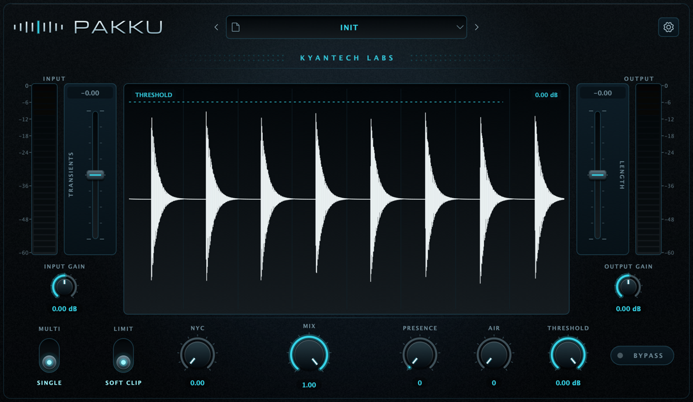
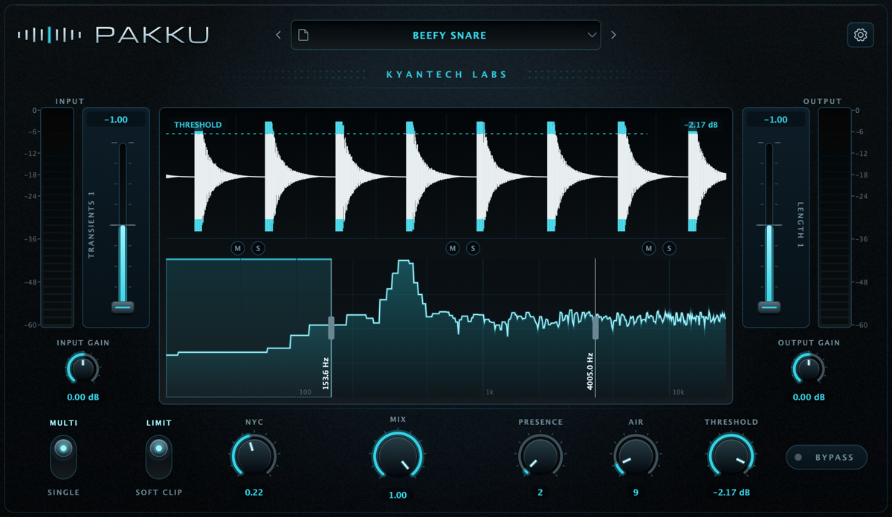

<div align="center">

# Pakku

**Multiband transient shaper for macOS and Windows.**
AU · VST3 · free · open source



</div>

---

## What it does

Pakku splits the signal into three bands with a Linkwitz–Riley 4th-order
crossover and reshapes the envelope of each one independently — attack on one
axis, sustain on the other. A tone section, parallel compression and a ceiling
stage (limiter or soft clipper) close the chain.

- **Three bands or full range.** One pair of faders, rebound to whichever band
  you pick on the spectrum. In single-band mode the spectrum steps aside and the
  waveform takes the whole display.
- **Draggable threshold.** Grab the dashed line over the waveform, or use the
  knob — same parameter, either way.
- **Linear-phase 4× oversampled ceiling**, limiter with 5 ms lookahead or a
  soft clipper with a knee below the threshold.
- **Latency compensated dry path**, so partial Mix does not comb-filter.
- **31 factory presets**, plus your own in an open format.
- **Three interface sizes**, remembered with the session.

<div align="center">

</div>

## Install

Grab the installer for your system from the
[latest release](https://github.com/danielalves96/pakku-vst/releases/latest).

| System | Download | Installs to |
| --- | --- | --- |
| macOS 11+ (Intel & Apple Silicon) | `Pakku-<version>-macOS.zip` | `/Library/Audio/Plug-Ins/Components` and `/Library/Audio/Plug-Ins/VST3` |
| Windows 10+ (64-bit) | `Pakku-<version>-Windows.zip` | `C:\Program Files\Common Files\VST3` |

Each archive holds three things at its root: the installer, the full user
manual as PDF, and a credits and licence file.

The macOS package lets you pick AU, VST3 or both. Rescan your plug-ins
afterwards — most hosts only look on startup.

> **Unsigned builds.** Until code signing is in place, macOS may refuse to open
> the installer. Right-click the `.pkg` → **Open** → **Open** confirms it once.
> On Windows, SmartScreen may ask for **More info** → **Run anyway**.

## Manual

A full user manual ships with the source: [docs/Pakku-Manual.pdf](docs/Pakku-Manual.pdf).
Eighteen pages covering the concept, installation on both systems, every
control, worked recipes and troubleshooting. Every curve in it is a
measurement of the running DSP rather than a drawing — regenerate the figures
with `pakku_figures`, then rebuild with
`python docs/manual/build_manual.py`.

## Presets

Presets use the plugin's own container: a four-byte `PKKU` signature, a format
version, and a binary `ValueTree` holding real parameter values — dB, Hz,
percent — not normalised ones, so files stay readable if ranges ever change.

```
~/Library/Audio/Presets/Kyantech Labs/Pakku/     (macOS)
%APPDATA%\Kyantech Labs\Pakku\                   (Windows)
    Factory/    shipped with the plugin, mirrored from the binary
    User/       yours — saved from the plugin, or dropped in from anywhere
```

`Factory/` is kept in step with the copies compiled into the binary, so an
update can deliver new or corrected presets, and a deleted or damaged file
comes back on its own. Anything you want to keep goes in `User/`, which is
never touched. **Rescan preset folder** in the settings panel re-reads both.

## Build from source

Requires CMake 3.22+ and a C++20 compiler. On macOS, Xcode command line tools;
on Windows, Visual Studio 2022.

```bash
git clone --recurse-submodules https://github.com/danielalves96/pakku-vst.git
cd pakku
cmake -B build -DCMAKE_BUILD_TYPE=Release
cmake --build build -j
```

Already cloned without `--recurse-submodules`? Run `git submodule update --init`.

The plugin is copied to your user plug-in folders after the build. macOS
produces universal binaries (`arm64` + `x86_64`).

### Installers

```bash
./packaging/macos/build-installer.sh          # → dist/Pakku-<version>.pkg
iscc packaging/windows/pakku.iss              # → dist/Pakku-<version>-Setup.exe
```

Signing and notarisation are picked up from environment variables when present —
see the header of `build-installer.sh`.

### Bench tools

Not needed to build the plugin; they exist to keep it honest.

| Tool | What it does |
| --- | --- |
| `pakku_dsptest` | Loads every factory preset, round-trips a user preset, measures ceiling aliasing |
| `pakku_guishot` | Renders the interface to PNG without a host; `--test-threshold` drives the threshold drag |
| `pakku_probe` | Renders the plugin offline to 32-bit float WAV, no host involved |
| `pakku_ostest` | Oversampler in isolation |
| `pakku_figures` | Renders the measured curves used by the manual |

## Layout

```
src/            plugin — DSP in src/dsp, interface in src/gui
resources/      factory presets, embedded font and icon licences
packaging/      macOS and Windows installers
tools/          measurement and rendering bench
docs/           screenshots
```

## Third-party

| Component | Licence |
| --- | --- |
| [JUCE](https://juce.com) | AGPLv3 (see below) |
| [Phosphor Icons](https://phosphoricons.com) | MIT — `resources/icons/LICENSE-phosphor.txt` |
| [Michroma](https://fonts.google.com/specimen/Michroma) | SIL OFL 1.1 — `resources/fonts/OFL-michroma.txt` |

## Licence

Pakku is released under the **GNU Affero General Public License v3.0** — see
[LICENSE](LICENSE).

The JUCE framework is dual-licensed: AGPLv3, or a paid commercial licence.
Pakku takes the AGPLv3 route, which is why the whole project carries it. If you
reuse this code in something you distribute, that project has to be AGPLv3 too,
unless you hold a JUCE licence of your own.

## Credits

Made in Brazil 🇧🇷 by **[Daniel Luiz Alves](https://github.com/danielalves96)**
under **Kyantech Labs**.

Pakku is free and stays free. If it earns a place in your chain, you can
[sponsor the next release](https://github.com/sponsors/danielalves96).
